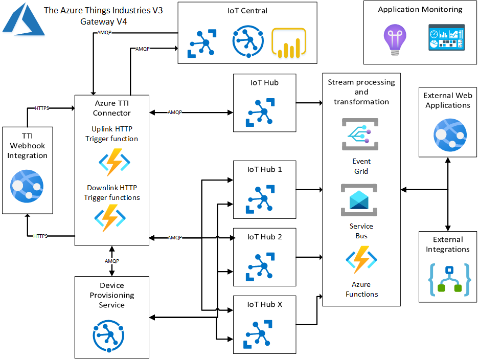

# TTIV3AzureIoTConnector
Azure IoT Identity Translation cloud gateway for The Things Stack using a webhook integration.

This project is based on the "learnings" from three other projects 

[TTI V3 Azure Storage Queues](https://github.com/KiwiBryn/TTIV3AzureIoTConnector/tree/master/HttpInputStorageQueueOutput)

[TTN V3 Azure IoT Connector](https://github.com/KiwiBryn/TTNV3AzureIoTConnector)

[TTN V2 Azure IoT Connector](https://github.com/KiwiBryn/AzureIoTTheThingsNetworkIntegration)

There is a fairly complete write up on [Hackster.IO](https://www.hackster.io/KiwiBryn/the-things-industries-tti-v3-azure-iot-connector-revisited-db93e8) 

For more detail I have a series of blog posts written as I was bulidng the connector

[TTN V3 Connector Revisited](http://blog.devmobile.co.nz/2021/10/04/ttn-v3-connector-revisited/)

[TTI V3 Connector Azure Storage Queues](http://blog.devmobile.co.nz/2021/10/20/tti-v3-connector-azure-storage-queues/)

[TTI V3 Connector Azure Storage Queues Paused](http://blog.devmobile.co.nz/2021/10/23/tti-v3-connector-azure-storage-queues-paused/)

[TTI V3 Connector Minimalist Device to Cloud(D2C)](http://blog.devmobile.co.nz/2021/10/28/tti-v3-connector-minimalist-device-to-cloud/)

[TTI V3 Connector Minimalist Cloud to Device(C2D)](http://blog.devmobile.co.nz/2021/10/31/tti-v3-connector-minimalist-cloud-to-devicec2d/)

[TTI V3 Connector Device Provisioning Service(DPS) support](http://blog.devmobile.co.nz/2021/11/03/tti-v3-connector-device-provisioning-servicedps-support/)

[TTI V3 Connector Azure IoT Central Device to Cloud(D2C)](http://blog.devmobile.co.nz/2021/11/04/tti-v3-connector-cloud-to-devicec2d/)

[Azure Device Provisioning Service(DPS) when transient isn’t](http://blog.devmobile.co.nz/2021/11/14/azure-device-provisioning-servicedps-when-transient-isnt/)

[TTI V3 Connector Azure IoT Central Cloud to Device(C2D)](http://blog.devmobile.co.nz/2021/11/17/tti-v3-connector-azure-iot-central-cloud-to-devicec2d/)
